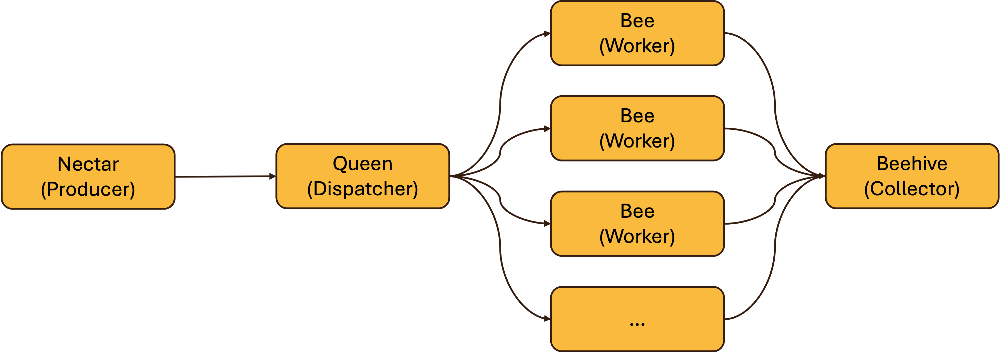

[](https://github.com/janniclas/beehive/blob/main/LICENSE)

# Beehive


----
## About
Beehive is a channel-based implementation of the Fan-Out and Fan-In pattern. It supports functionality to spawn a customizable number of generic worker goroutines. The worker must be configured with a custom function to process the incoming data.
Every worker is linked to a buffered collector that processes the incoming data.
The coordination is handled centrally by the dispatcher.



*Illustration of the Fan-Out and Fan-In Pattern*
## Usage

```Go
// initialize worker that processes ints and produces strings
worker := beehive.Worker[int, string] {
	Work: func(i *int) (*string, error) {
		s := fmt.Sprintf("processed:%d", *i)
		return &s, nil
	},
}

buffer := 1
collect := func(s []*string) error {
	// perform action on all collected strings
	// e.g., store them to a database

	return nil
}
// initialize collector with matching type
collector := beehive.NewBufferedCollector[string](
	collect,
	beehive.BufferedCollectorConfig{
		BufferSize: &buffer,
	},
)

producer := []int{1, 2, 3, 4}

// configure the number of workers. depending on the
// task the number of cores might be a good idea
numWorker := 4

dispatcher := beehive.NewDispatcher(
	worker,
	slices.Values(producer),
	collector,
	beehive.DispatcherConfig{
		NumWorker: &numWorker,
	},
)

// starts the processing and blocks until producer
// is finished and all workers finished processing
dispatcher.Dispatch()
```
For more examples see the project's tests or the `examples`.
